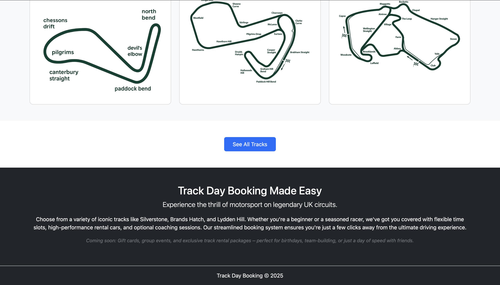

# 📘 Track Day

**Track Day** is a Django-based full-stack web application for motorsport enthusiasts to book and manage their track day experiences at popular UK circuits like Brands Hatch, Silverstone, and Lydden Hill. Users can choose available cars, time slots, and ride options (e.g. with/without instructor), and view or edit their bookings.

## 🔗 Live Demo

[Track Day App](https://track-day-b7bd1e661185.herokuapp.com)

[GitHub Repository](https://github.com/TinaGrigorova/track-day)

---

## User Experience (UX)

Track Day delivers a streamlined and adrenaline-pumping user experience for motorsport enthusiasts across the UK. The platform is built with intuitive navigation, a modern UI, and clear call-to-action prompts to guide users from track discovery to final booking. Whether you're a seasoned driver or a curious newcomer, Track Day offers detailed track insights, car rental options, and ride preferences to personalize the booking experience. The platform is fully responsive, making it effortless to explore and book track sessions on both desktop and mobile devices.

### Project Goals

The goal of the Track Day project is to provide users with a dynamic, accessible, and engaging platform for exploring and booking track driving experiences across the UK. The project is focused on simplifying the booking process while offering a wide range of track and ride options, complete with clear information and visuals. By centralizing availability, ride choices (with instructor, without instructor, passenger), and car rental selections, Track Day aims to elevate the motorsport experience into a user-friendly digital service.

### Agile Methodology

Agile Methodology was adopted to efficiently plan, execute, and iterate development for Track Day. A GitHub Project Board and a user story template were used throughout the project lifecycle.

Epics were defined to group user stories under broader goals (e.g., Booking Management, Track Discovery, User Authentication).
User Stories were written using the standard format:
As a [user], I can [action] so that [goal], with clear acceptance criteria.
The GitHub Project Board was made public to track progress in columns: To Do, In Progress, and Done.
Labels (such as Bug, Enhancement, Testing, Priority) were applied to issues for better visibility and prioritization.
Iterative development allowed continuous improvements based on testing feedback and alignment with the user journey.

### User Stories

#### Epics
* Initial Deployment
* Home Page
* User Registration
* Website Admin and Bookings
* Maintain consistent design with responsiveness in mind

#### User Stories
1. Initial Deployment
* Create new Heroku application
* Link Github repository to the Heroku app
2. Home Page
* Create a navigation bar
* Create a footer
3. User Registration
* Sign Up page
* User registration, log in, log out
* Display users name
4. Website Admin and Bookings
* Alert messages
* Crud functionality
* Admin panel
* Book Amenities
4. Maintain consistent design with responsiveness in mind
* Maintain consistent design
* Test responsiveness

### Target Audience

* Motorsport enthusiasts looking to book driving experiences at various UK race tracks.
* First-time drivers or curious thrill-seekers wanting to try a track experience in a controlled environment.
* Car lovers interested in renting high-performance vehicles for the day.
* Individuals planning unique experiences (e.g. birthdays, team-building events, or gift experiences).
* Users who value a fast and reliable online booking process.
* Mobile users who prefer booking on-the-go via phones or tablets.
* Tourists or visitors in the UK looking for an adventurous and memorable activity.
* Instructors and passenger ride fans who want track access with or without driving.

### First time user

* Clear and responsive navigation across all devices to explore tracks and booking options.
* Visually engaging track cards and images to showcase the experience and help with selection.
* Concise and informative descriptions of each race track and rental car.
* Straightforward sign-up process with validation and error handling.
* Easy-to-understand booking form with dropdowns for time slot, track, car, and ride preferences.
* Prominent “See All Tracks” and “Book Now” CTAs to guide user flow.

### Registered User

* Secure login with feedback messages and access to their account dashboard.
* Ability to browse all available tracks and cars.
* Personalized booking options including time slot and ride type (passenger, with instructor, or solo).
* Access to booking history and upcoming bookings via the “My Bookings” page.
* Ability to edit or cancel bookings with clear confirmation prompts.
* Form pre-fills with existing booking details to ease the editing experience.
* Success messages and redirect logic confirming changes or cancellations.

### Admin user
* Secure and dedicated login portal with role-based access control to protect sensitive admin operations.
* Full access to a centralized admin dashboard for managing users, tracks, cars, and bookings.
* Ability to add, edit, or remove track listings, including names, descriptions, images, and availability.
* Management of rental cars, with functionality to update specifications, availability, and ride options.
* Control over user accounts, including the ability to deactivate or delete users when required.
* Oversight of all bookings, with options to view, update, or cancel any booking from the admin interface.
* Ability to handle support issues and maintain data integrity through Django's built-in admin features.

---

## Design

The Track Day Booking website features a bold and sporty aesthetic that mirrors the excitement of motorsport. A dynamic and responsive design ensures users on all devices have a seamless experience. The homepage highlights three featured tracks with preview images and star icons to indicate popularity. A clean navigation bar allows users to easily access track listings, login/register, or return home. Track cards feature custom circuit illustrations and responsive hover effects for a modern UI. The booking forms are intuitive, styled with Bootstrap, and follow a consistent dark-on-light visual hierarchy. The footer is fixed, styled to complement the site's tone, and includes copyright info.

### Color Scheme

### Wireframe

 Home Page

 Home Page when logged in

 Make a Booking Page

 My Booking Page

 Edit Booking Page

 Delete Booking Page

 User Login Page

---
## 📸 Screenshots

- **Homepage** – With featured tracks  
  `booking_system/images/screenshot-homepage.png`

- **All Tracks** – Grid layout with track info and "Book Track" buttons  
  `booking_system/images/screenshot-tracks.png`

- **Booking Form** – Includes date, time, car, and ride options  
  `booking_system/images/screenshot-booking-form.png`

- **My Bookings** – User view of their current reservations  
  `booking_system/images/screenshot-my-bookings.png`

---

### Data Models

1. User Model
  
* Utilizes Django's built-in User model, enhanced with Django Allauth for authentication and account management.
* Each User can have multiple Bookings, establishing a one-to-many relationship between User and Booking.
2. Track Model
  
* Represents individual race tracks available for booking.
* Fields include name, description, location, and an image representing the track.
* Each Track can have multiple Bookings, but each Booking is associated with only one Track, forming a one-to-many relationship.
  
3. Car Model
* Represents cars available for rental during track days.
* Fields include make, model, year, and availability status.
* Each Car can be associated with multiple Bookings, but each Booking is linked to only one Car, establishing a one-to-many relationship.
  
4. Booking Model
* Central model that ties together Users, Tracks, and Cars.
* Fields include:
  * User (ForeignKey to User model)
  * Track (ForeignKey to Track model)
  * Car (ForeignKey to Car model)
  * Date of booking
  * Time slot
  * Ride option (e.g., with instructor, without instructor)
* Implements validation to prevent overlapping bookings for the same track and time slot.
* Provides full CRUD functionality, allowing users to create, view, update, and delete their bookings.
---
## Security Features

### User Authentication
* Implemented using Django Allauth, providing comprehensive features for user registration, login, logout, password reset, and email verification. ​

### Login Decorator
* Views such as booking_create, booking_success, booking_overview, edit_booking, and delete_booking are protected using Django's @login_required decorator.
* This ensures that only authenticated users can access booking-related functionalities.​

### CSRF Protection
* Django provides built-in protection against Cross-Site Request Forgery (CSRF) attacks.
* CSRF tokens are generated per user session and are required for form submissions and state-changing actions.
* Upon user logout, the session and associated CSRF token are invalidated, mitigating the risk of forged requests.​

### Form Validation
* The booking_create view utilizes the BookingForm class to validate user input.
* Validation checks include ensuring selected date and time slots are available, and that all required fields are correctly filled.
* Custom validation logic prevents overlapping bookings by checking existing bookings for the selected track and time slot.​

### Custom error pages
* Custom 404 (Page Not Found) and 500 (Internal Server Error) pages are implemented to enhance user experience.
* These pages provide informative messages and a button to redirect users back to the homepage.​

---
## Features

* Browse and learn more about UK tracks.
* Select and book a track with time and ride options.
* Secure user authentication (register/login/logout).
* View, edit, or cancel bookings.
* Admin interface to manage tracks, cars, and bookings.
* Protected views for booking and user access.

### Existing Features

* Home Page
  
  
  
  
* Navigation Bar
   
* Futured Tracks Cards
   
  * Lydden Hill Track
   
  * Brans Hatch Track
   
  * Silverstone Track
   
* Booking Page
  
  * Booking Options:
  * Car Option
    
  * Ride Option
    
  * Time Slot
    
  * Track Option
    
* Edit Booking
  
* Cancel Booking
  
* My Bookings
  
* Login Page
  
* Sign Up Page
  
* Confirmation Messages
  
  
* Information Part
  
* Footer
  

  
---

## 🛠️ Technologies Used

| Type            | Stack                            |
|-----------------|----------------------------------|
| Frontend        | HTML5, CSS3, Bootstrap 5         |
| Backend         | Python 3.12, Django 4.2.1        |
| Database        | PostgreSQL                       |
| Authentication  | Django built-in Auth             |
| Hosting         | Heroku                           |
| Version Control | Git, GitHub                      |

---
### Databases Used

* [ElephantSQL](https://www.elephantsql.com/) - Postgres database

### Frameworks & Libreries
* Django – A high-level Python web framework that encourages rapid development and clean, pragmatic design.
* Django Allauth – Integrated for comprehensive user authentication, registration, and account management.
* Bootstrap 5 – Utilized for responsive design and styling, ensuring a mobile-first and consistent user interface.
* Heroku – Platform-as-a-Service (PaaS) used for deploying and hosting the web application.

### Programs Used

* [Github](https://github.com/) - Storing the code online
* [Gitpod](https://www.gitpod.io/) - To write the code.
* [Heroku](https://www.heroku.com/) - Used as the cloud-based platform to deploy the site.
* [Google Fonts](https://fonts.google.com/) - Import main font the website.
* [Figma](https://www.figma.com/) - Used to create wireframes and schemes
* [Git](https://git-scm.com/) - Version control
* [Favicon Generator](https://realfavicongenerator.net/) - Used to create a favicon
* [JSHint](https://jshint.com/) - Used to validate JavaScript
* [W3C Markup Validation Service](https://validator.w3.org/) - Used to validate HTML
* [CSS Validation Service](https://jigsaw.w3.org/css-validator/) - Used to validate CSS
* [CI Python Linter](https://pep8ci.herokuapp.com/#) - Used to validate Python
* [Colormind](http://colormind.io/) - Color Scheme

---
## Deployment and Local Developement

Live deployment can be found on this [View live website here](https://track-day-b7bd1e661185.herokuapp.com)

### Local Developement

#### How to Fork
1. Log in(or Sign Up) to Github
2. Go to repository for this project[Track Day](https://github.com/TinaGrigorova/track-day)
3. Click the fork button in the top right corner

#### How to Clone
1. Log in(or Sign Up) to Github
2. Go to repository for this project [Track Day](https://github.com/TinaGrigorova/track-day)
3. Click on the code button, select whether you would like to clone with HTTPS, SSH or GitHub CLI and copy the link shown.
4. Open the terminal in your code editor and change the current working directory to the location you want to use for the cloned directory.
5. Type the following command in the terminal (after the git clone you will need to paste the link you copied in step 3 above)
6. Set up a virtual environment (this step is not required if you are using the Code Institute Template in GitPod as this will already be set up for you).
7. Install the packages from the requirements.txt file - run Command pip3 install -r requirements.txt

### ElephantSQL Database
[Track Day](https://github.com/TinaGrigorova/track-day) is using [ElephantSQL](https://www.elephantsql.com/) PostgreSQL Database

1. Click Create New Instance to start a new database.
2. Provide a name (this is commonly the name of the project: tribe).
3. Select the Tiny Turtle (Free) plan.
4. You can leave the Tags blank.
5. Select the Region and Data Center closest to you.
6. Once created, click on the new database name, where you can view the database URL and Password.

### Heroku Deployment
* Log into [Heroku](https://www.heroku.com/) account or create an account.
* Click the "New" button at the top right corner and select "Create New App".
* Enter a unique application name
* Select your region
* Click "Create App"

#### Prepare enviroment and settings.py
* In your GitPod workspace, create an env.py file in the main directory.
* Add the DATABASE_URL value and your chosen SECRET_KEY value to the env.py file.
* Update the settings.py file to import the env.py file and add the SECRETKEY and DATABASE_URL file paths.
* Comment out the default database configuration.
* Save all files and make migrations.
* Add the Cloudinary URL to env.py
* Add the Cloudinary libraries to the list of installed apps.
* Add the STATIC files settings - the url, storage path, directory path, root path, media url and default file storage path.
* Link the file to the templates directory in Heroku.
* Change the templates directory to TEMPLATES_DIR
* Add Heroku to the ALLOWED_HOSTS list the format ['app_name.heroku.com', 'localhost']

#### Add the following Config Vars in Heroku:

* SECRET_KEY - This can be any Django random secret key
* PORT = 8000
* DISABLE_COLLECTSTATIC = 1 - this is temporary, and can be removed for the final deployment
* DATABASE_URL - Insert your own ElephantSQL database URL here

#### Heroku needs two additional files to deploy properly

* requirements.txt
* Procfile

#### Deploy

1. Make sure DEBUG = False in the settings.py
2. Go to the deploy tab on Heroku and connect to GitHub, then to the required repository.
3. Scroll to the bottom of the deploy page and either click Enable Automatic Deploys for automatic deploys or Deploy Branch to deploy manually. Manually deployed branches will need re-deploying each time the GitHub repository is updated.
4. Click 'Open App' to view the deployed live site.

---
## 🧪 Testing

Testing was performed manually and via Django’s built-in testing tools.

- Form validation for date and time
- Duplicate booking prevention
- Login/logout/signup processes
- Mobile responsiveness
- Booking updates/cancellation

➡️ See full documentation: [`TESTING.md`](TESTING.md)

### Content

* All of the content is imaginary and written by the developer, me, Tina Grigorova.

### Acknowledgments

* I would like to thank my mentor for support and feedback throughout this project, Mitko Bachvarov.
* I would also like to extend my appreciation to the Slack community for their continuous engagement and willingness to share knowledge. The collaborative environment provided a platform for learning, troubleshooting, and gaining inspiration from fellow developers.

## Future Enhancements

- Stripe integration for paid bookings
- Track day gift cards
- Admin calendar for track slot availability
- Booking confirmation email

