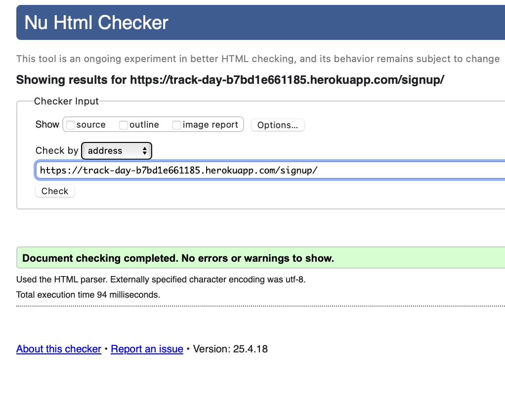
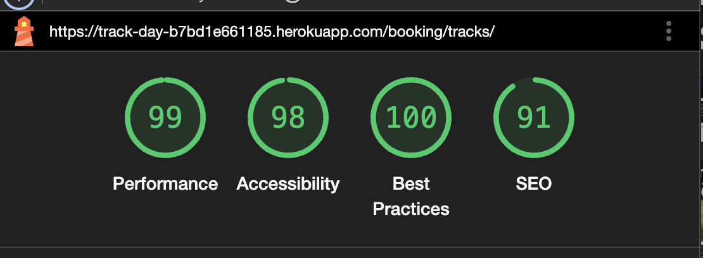
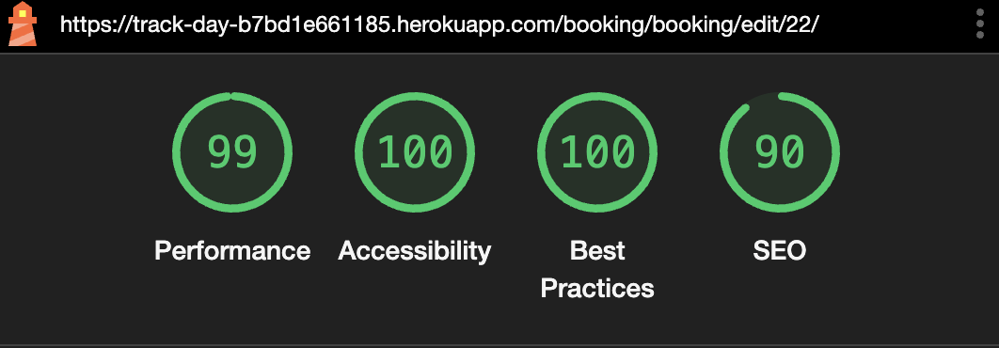

# Track Day | Testing

Return to [README](README.md)
- - -
Comprehensive testing has been performed to ensure the website's seamless and optimal functionality.

## Responsiveness Testing

The Track Day website was meticulously tested across a variety of devices and screen sizes to ensure optimal responsiveness and user experience. Utilizing browser developer tools, such as Chrome DevTools, the site was evaluated in simulated environments representing smartphones, tablets, and desktops. This process allowed for real-time adjustments and ensured that the layout and functionality remained consistent across different viewports.​

 Desktop PC

 Laptop

 Tablet

 Mobile

## Browser Compatibility Testing

The Track Day website was rigorously tested across multiple web browsers to ensure consistent functionality and appearance. This testing process guarantees a smooth and uniform user experience, regardless of the browser used.​

 Opera

 Microsoft Edge

 Safari

 Iphone Internet (Mobile)

## Device Testing

Device testing was conducted on a variety of phone models, including Iphone 11, Oppo, iPhone 14, Huawei. The assistance of family members and friends was sought to perform the testing. This comprehensive approach ensured that the website was thoroughly evaluated on different devices and platforms, contributing to a more robust and user-friendly final product.

---
## Code Validation

### HTML Validation

 Home Page

 Sign Up Page

 Login Page

  

 Make a Booking Page

 My Bookings

 Edit Booking Page

  

 Delete Booking Page

 Lydden Hill

  Silverstone 

  Brands Hatch 

  All Tracks

### CSS Validation

 Custom CSS (style.css)

### Python

#### booking-system app

 admin.py

 forms.py

 models.py

 views.py

 urls.py

 tests.py

#### track-day App

 settings.py

 urls.py

## Lighthouse Report

 Home Page

 Sign Up Page

 Login Page

 All Tracks Page

 Make a Booking Page

 My Bookings

 Edit Booking Page

  

 Delete Booking Page

## Bugs

### Resolved Bugs

| Bug                                       | Fix                                                                                                          |
|:------------------------------------------|:-------------------------------------------------------------------------------------------------------------|
| Cannot edit only ride option              | Updated form logic to mark the form as changed even when only 'ride_option' is altered.                      |
| Car change not saving                     | Modified the form validation to properly detect and accept car-only changes by adjusting clean method.       |
| Favicon missing in production             | Ran `collectstatic`, confirmed favicon.ico is in staticfiles, ensured correct path and debug=False behavior. |
| Neon DB SSL connection error              | Appended `?sslmode=require` to DATABASE_URL in `env.py` and ensured secure connection settings.              |
| Static files not loading with DEBUG=False | Configured `STATICFILES_STORAGE` and verified manifest entries are generated correctly.                      |

## Features Testing
 
| Page                | User Action                                      | Expected Result                                              | Status |
|---------------------|--------------------------------------------------|---------------------------------------------------------------|--------|
| **Home Page**       | Click on Logo                                    | Redirect to Home Page                                        | ✅ PASS |
|                     | Click on Sign Up button                          | Redirect to Sign Up page                                     | ✅ PASS |
|                     | Click on Login                                   | Redirect to Login page                                       | ✅ PASS |
|                     | Click on a Track Card                            | Redirect to Track Detail page                                | ✅ PASS |
|                     | Click on "See All Tracks"                       | Redirect to All Tracks listing page                          | ✅ PASS |
|                     | Hover on Track Card                              | Card zooms and reveals full description                      | ✅ PASS |
|                     | Click on Book Track                              | Redirect to Book Track page                                  | ✅ PASS |
| **Sign Up Page**    | Fill invalid form                                | Displays validation errors                                   | ✅ PASS |
|                     | Submit valid form                                | Account created and redirected to homepage                   | ✅ PASS |
|                     | Click login link                                 | Redirect to login page                                       | ✅ PASS |
| **Login Page**      | Submit invalid credentials                       | Displays error message                                       | ✅ PASS |
|                     | Submit valid credentials                         | Redirect to homepage, user greeted                           | ✅ PASS |
|                     | Click sign up link                               | Redirect to signup page                                      | ✅ PASS |
| **Booking Page**    | Not logged in                                    | Redirected to login page                                     | ✅ PASS |
|                     | Submit empty form                                | Display validation errors                                    | ✅ PASS |
|                     | Select valid data                                | Booking successful, redirected to My Bookings                | ✅ PASS |
|                     | Try booking same track, date, time               | Validation error, can't double book                          | ✅ PASS |
| **My Bookings**     | View booking details                             | Details displayed in table                                   | ✅ PASS |
|                     | Click Edit                                       | Redirect to Edit Booking page                                | ✅ PASS |
|                     | Click Cancel                                     | Booking is deleted                                           | ✅ PASS |
| **Edit Booking**    | Change valid details and submit                  | Booking updates successfully                                 | ✅ PASS |
|                     | Only change ride/car option and submit           | Booking updates successfully                                 | ✅ PASS |
|                     | Submit conflicting time/date                     | Validation error                                              | ✅ PASS |
| **All Tracks**      | Hover card                                       | Show full description overlay                                | ✅ PASS |
|                     | Click Book Track                                 | Redirects to Book page with selhttps://github.com/TinaGrigorova/track-day/blob/main/TESTING.mdected track                   | ✅ PASS |
| **Track Detail Pages** | View track info                              | Track information and gallery loads                          | ✅ PASS |
|                     | Click Book this Track                            | Redirect to booking form                                     | ✅ PASS |
|                     | Click Back                                       | Returns to homepage                                          | ✅ PASS |
| **Error Pages**     | Type invalid URL                                 | Custom 404 page appears                                      | ✅ PASS |
|                     | Trigger error manually (dev)                     | Custom 500 page appears                                      | ✅ PASS |

## Manual Testing

### ✅ Core Features Tested

#### 1. **User Registration & Login**
- Registered with valid email and password
- Logged in successfully
- Invalid login tested with appropriate error feedback

#### 2. **Booking a Track**
- User can choose a track, date, car, time, and ride option
- Booking confirmation displays success message
- Booking duplicates blocked by validation

#### 3. **View/Edit/Cancel Bookings**
- View bookings in a clean table
- Edit functionality pre-fills form
- Successfully updates all fields
- Booking cannot be edited to overlap an existing one

#### 4. **Error Pages**
- 404, 500, 403, and 400 error pages implemented with custom design

#### 5. **Authentication**
- Booking page is protected: redirects unauthenticated users to login

Return to [README](README.md)

---

Tested across latest Chrome, Firefox, and Safari browsers. Responsive tests done with dev tools and real devices.